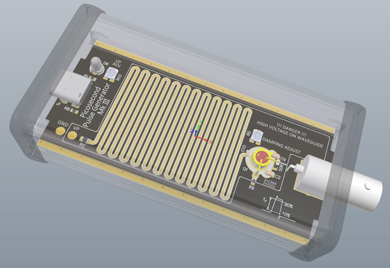

# Jim-Williams-PulseGenerator
 Jim Williams Pulsegenerator, SiliconvalleyGarage Edition

## MK-III Features:

The Mark-III is a big rework

- Switched to a metal case
- Switched to a BNC connector with floating center electrode
- Added damping adjust to compensate overshoot
- Reworked the waveguie "long capacitor" to take advantage of 4 layer board
- Different swithing regulator that is much cheaper than the LT1377.
- 5-stage high voltage cascade
- trimming adjustment for avalanche voltage
- USB-C power connection. No more batteries.
- Endcaps for both sides as a predrilled PCB that fit the Hammond Enclosure
  
## Layout

The Board is a 4 layer PCB that can easily be produced by the likes of JLCPCB or PCBway.  A full production pack (Gerber / NCdrill, BOM , Pick and place ) is available. 

## Assembly

The Bom and pick and place is included for assembly using LCSC parts at JLCPCB. The BOM also includes MOUSER part numbers

## Source Files

All source files are available in Altium Format. That's what i know, have and use. Other CAD programs most likely can import those. So you can modify.

## License

The project is PUBLIC DOMAIN. Do as you please. No warranties, As-Is
Creative Commons Zero.
