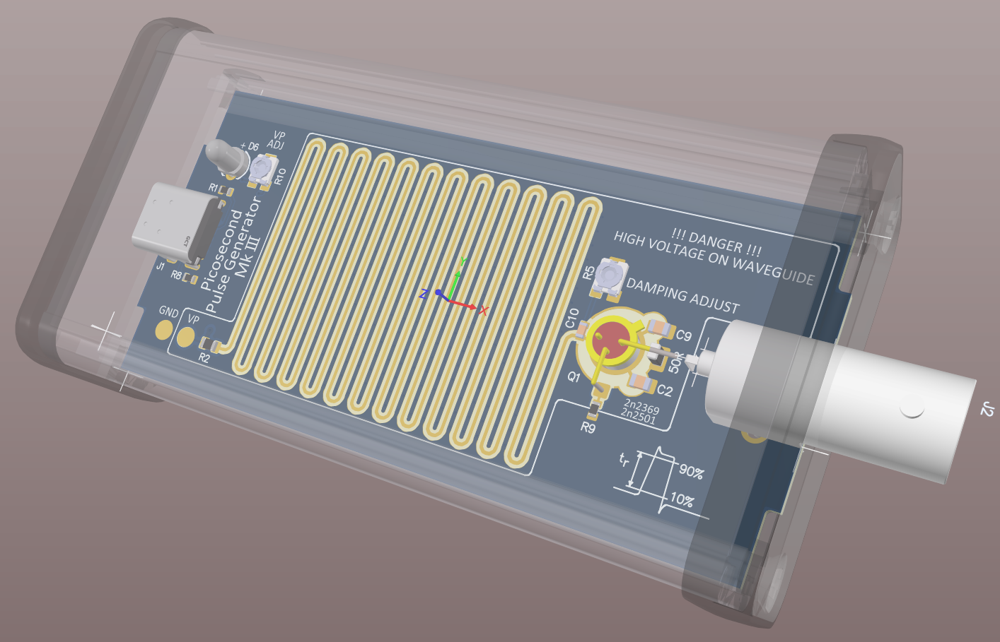

# Jim-Williams-PulseGenerator
 Jim Williams Pulsegenerator, SiliconvalleyGarage Edition

MK-III

The Mark-III is a big rework

- Switched to a metal case
- Switched to a bnc connector with floating center electrode
- Added damping adjust to compensate overshoot
- Reworked the waveguie "long capacitor" to take advantage of 4 layer board
- Different swithing regulator that is much cheaper than the LT1377.
- 5-stage high voltage cascade
- trimming adjustment for avalanche voltage
- USB-C power connection. No more batteries
